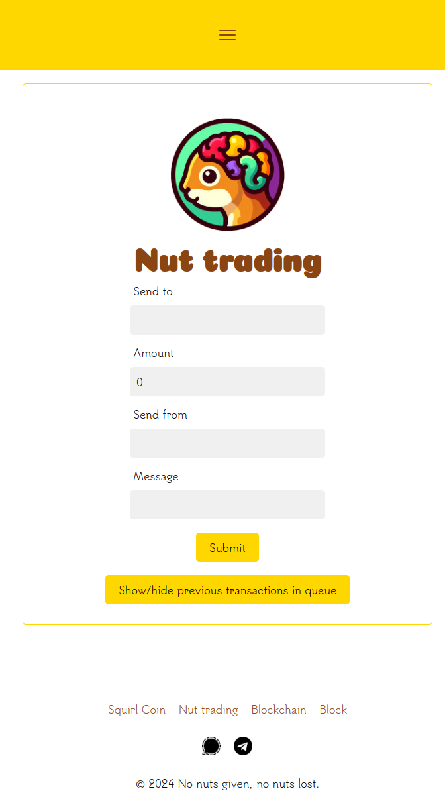

# SquirlCoin

## :sparkles: Team

- [Carl](https://github.com/Reblixt)
- [Oskar](https://github.com/nativealien)
- [Rasmus](https://github.com/devmus)
- [Sanjin](https://github.com/codebatine)

## :calendar: Agile Schedule

Daily standup weekdays at 8:30 AM.

## :link: Endpoints Used in the Original Version

- http://localhost:5001/api/v1/squirlchain/fetchsquirls
- http://localhost:5001/api/v1/squirlchain/fetchsquirls/1
- http://localhost:5001/api/v1/squirlchain/block/breed
- http://localhost:5001/api/v1/squirlchain/nuttradings/nuttrading

## :wrench: Dev Environment

- system: sudo service redis-server start
- /backend npm run dev
- /frontend npm run dev

## :camera_with_flash: Screenshot

